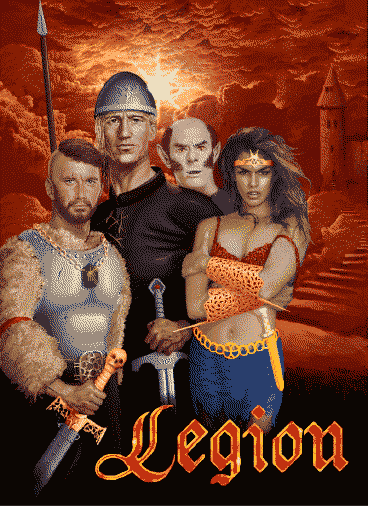

# Legion .NET

Classic Amiga game - Legion - rewritten in C# language, based on the official AMOS source code provided by authors. 

Multiplatform in mind, but currently focused on Windows. 

Polish and English languages, but should be possible to add more later.

## Original source code
Original source code and files can be found in /original folder

## Techonology stack
MonoGame on .Net 6.

## Status
Kind of alpha-version quality at the moment, can be playable with more or less annoying issues. 

### Known issues
- [ ] incorrect transparency for shop backgrounds images, equipment slots
- [ ] invisible texts during intro due to wrong color
- [ ] missing sword animation during intro
- [ ] missing sounds
- [ ] ...

## Issues derived from original version
- [ ] cloning items when putting them on the ground and loading game after that (items on the ground will stay on the same place)
- [ ] characters path finding is poor

## Links
* Original source code: https://www.ppa.pl/rodzynki/legion.html
* Interview with author 1 [PL]: https://www.ppa.pl/gry/rozmowa-z-marcinem-puchta-wspolautorem-gry-legion.html
* Interview with author 2 [PL]: https://www.ppa.pl/gry/rozmowa-z-andrzejem-puchta-autorem-gry-legion.html
